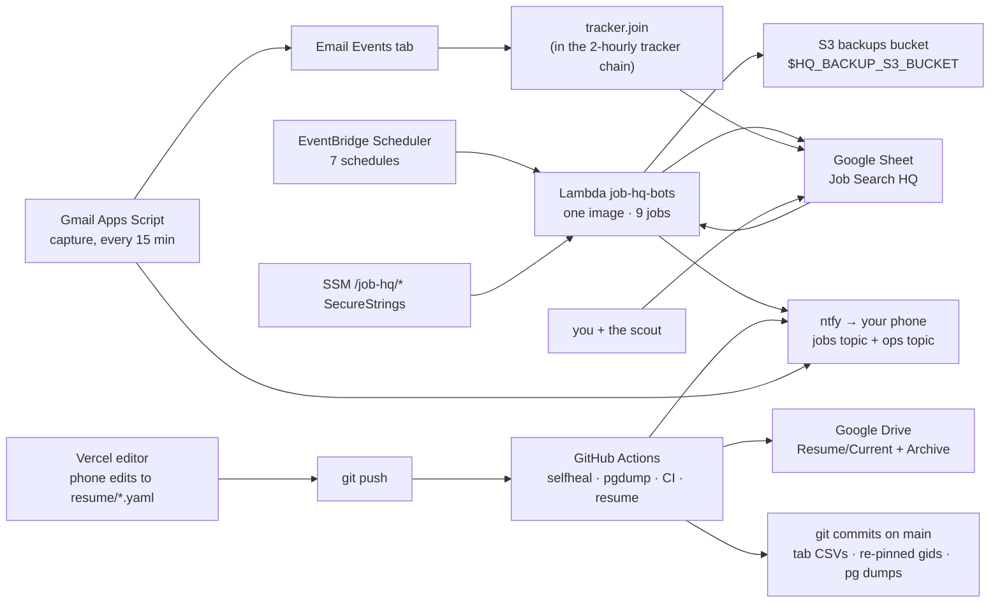
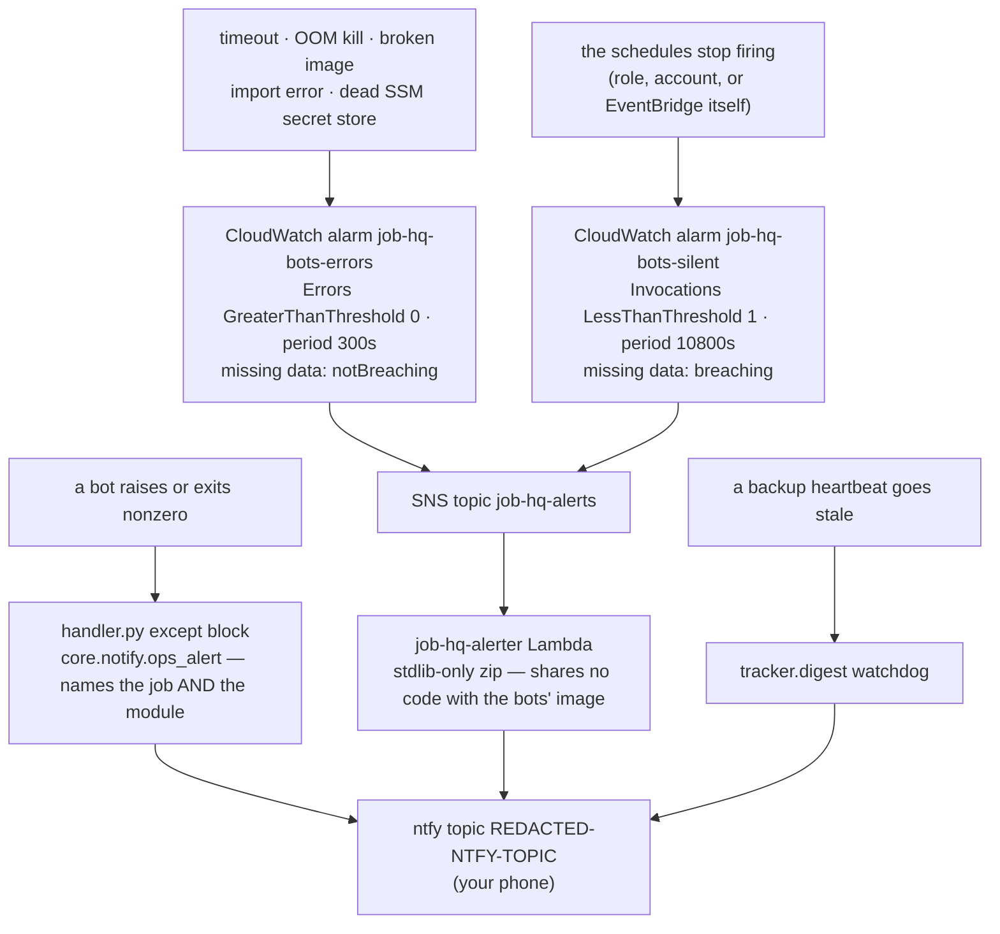

# The system, in plain English

Your map of what runs, where, what pages your phone, and what to type when you want to check on
it. Written for the owner, not for an infra engineer.

**The prose below is human-maintained** — edit it freely, nothing overwrites it. **Everything
under "Generated reference" is machine-generated** from the repo's own sources (Terraform, the
Lambda handler, the workflow files, `core/schema.py`, `hq.config.yaml`): run
`python scripts/sysmap.py` after any infra, schedule, alert, or schema change. CI fails if you
forget, the same way a stale lockfile fails.

---

## 1. What this system is

Five subsystems, one spreadsheet ("Job Search HQ") as the cockpit.

**Discovery.** Twice a day a sweep hits ~640 companies' boards through 12 ATS adapters (plus two
wide sweeps, hiring.cafe and TheirStack, as the safety net for everything not on that list),
writes new roles into the **Feed** tab, and tags each with Claude Haiku. Roles passing the
years-of-experience rule get pushed to your phone; a nightly pass re-tags whatever failed inline.

**Tracker.** Every funnel — Feed ★-picks, the scout's tab, Quick Add URL pastes, the retired
Simplify import — merges into one deduped **Pipeline** keyed on ATS-native job ids. The chain runs
every two hours: promote → quick-add → scout sync → stale flags → email-event join.

**Gmail capture.** An Apps Script in your main Gmail account wakes every 15 minutes, gates
ATS/status mail, classifies it with Haiku, appends it to the **Email Events** tab, and pushes
instantly for OA/interview/recruiter/offer mail. That is why "applied" is never marked by hand:
the confirmation email is the evidence, and `tracker.join` advances the row with a link to it.

**Resume pipeline.** `resume/base.yaml` + `resume/design.yaml` are the source of truth; any push
to `main` touching `resume/` re-renders both variants with a pinned RenderCV, hard-fails unless
it is exactly one page, publishes PDF/DOCX to Drive, and sends a preview to your phone. Nobody
hand-distributes a render, so what people receive cannot drift from the YAML.

**Phone editor.** A small Next.js app on Vercel that edits those two YAMLs from your phone and
commits. A commit is a commit, so the pipeline above fires and gates it — a bad phone edit fails
CI instead of shipping.

## 2. Where things physically run

| Where | What lives there | Secrets from |
|---|---|---|
| **AWS Lambda + EventBridge** | every recurring bot: one container image, one function, one schedule per job | SSM Parameter Store, `/job-hq/*` |
| **GitHub Actions** | CI, the resume render/publish, the two jobs whose product is a git commit — plus every bot kept as a dispatch-only manual run | GitHub repo secrets |
| **Google Apps Script** | Gmail capture + the 7am digest email (in your account); the Drive uploader the resume pipeline publishes through | Script properties |
| **Vercel** | the phone editor | its own env |

**The rule for the split: if a job's product is a git commit, it stays on GitHub Actions.**
Lambda's filesystem is read-only, so a commit-shaped job there would silently write nothing, and
a backup that silently doesn't happen is worse than none. That is why self-heal (schema re-assert
+ CSV snapshots + the re-pinned `hq.config.yaml`) and the PG dump stayed behind when everything
else moved to AWS on 2026-07-25. Every bot that moved kept its workflow as dispatch-only: the
one-click manual re-run, and the fallback for the day the problem *is* AWS.

## 3. What pages your phone, and when

Two ntfy topics, meaning different things. **The jobs topic** is the useful stuff: new roles that
match, instant OA/interview mail, resume previews. **The ops topic is failures only — silence
means healthy**; nothing ever sends an "all good" push.

Three layers reach ops, each catching what the others can't:

1. **The Lambda handler** pushes on every bot failure, and is the only layer that can say *which*
   bot died (one function runs them all): `[lambda] tracker failed` plus the failing module.
2. **Two CloudWatch alarms** catch what in-process code can't report — timeout, out-of-memory
   kill, broken image, dead secret store — and, separately, three hours with no invocation at all,
   where missing data counts as bad news. Both push again when they clear.
3. **The digest's backup watchdog** pages "HQ backups stale" naming the dead lane, because a
   backup that stopped is otherwise invisible until restore day.

Actions workflows each push to the same ops topic on failure, with a link to the run.

## 4. How to check on things / do things

```sh
# What did the bots just do, and what did they say? — first thing to run after any ops push.
aws logs tail /aws/lambda/job-hq-bots --since 30m

# Run one job right now — after fixing something, or to clear a red alarm.
aws lambda invoke --function-name job-hq-bots --payload '{"job":"digest"}' \
  --cli-binary-format raw-in-base64-out /tmp/out.json && cat /tmp/out.json

# Ship code to the bots: build → push by git SHA → pin the function. Refuses a dirty tree.
infra/deploy.sh
# Roll back to any SHA already in ECR:
# aws lambda update-function-code --function-name job-hq-bots --image-uri "${ECR}:<older-sha>"
#   (keep the braces: zsh parses "$ECR:..." as a modifier and mangles the tag)

# What has drifted / what would an apply change? Read-only, changes nothing.
cd infra/terraform && terraform plan

# Re-run a bot when AWS is the problem: GitHub app → Actions → the workflow → Run workflow.
# Same code, same secrets — every migrated bot kept that trigger for exactly this.

# Restore a tab after a bad human edit — two independent copies, pick either.
git show <sha>:snapshots/hq/pipeline.csv > /tmp/pipeline.csv     # the git copy
aws s3api list-object-versions --bucket job-hq-backups-690340855657 \
  --prefix snapshots/hq/pipeline.csv                            # the S3 copy (versions = history)
```

Symptom → cause → fix: `docs/RUNBOOK.md`. AWS setup and ops detail: `infra/README.md`.

## 5. How we got here

1. **2026-07-13** — consolidation spec (`docs/SPEC.md`) approved, then the engine built,
   researched and tested in one pass; `job-monitor` + `resume-drafting` merged into this repo.
2. **Same week** — the HQ sheet bootstrapped: tabs, headers, protections, Companies seed, gids
   pinned into `hq.config.yaml`.
3. **#53** — the scheduled bots ported to Lambda + EventBridge, deliberately double-running
   alongside the Actions crons while unproven.
4. **#57** — both alert layers built and verified live, and only then the Actions crons retired;
   self-heal and PG dump stayed under the git-commit rule.
5. **#58** — memory 512 → 1024 MB after the first Lambda-owned sweep peaked at 486 MB, one step
   from the OOM kill the handler structurally cannot report.
6. **#59** — hardening, motivated by the 2026-07-24 Actions billing lapse that stopped every
   schedule for 21 h with no backup and no alert: the sheet backup now also lands in S3 on a
   scheduler AWS owns end to end (each lane with its own heartbeat), plus per-user schedule
   fan-out, a runtime-deadline clamp so a sweep stops cleanly instead of being killed, and
   SHA-pinned deploys.

## 6. The forks not taken, and the known gaps

- **PG dump is gated off** (`PGDUMP_ENABLED` repo variable): no live Supabase behind it, so
  there is nothing to dump. An empty backup job running in two places is not redundancy.
- **ntfy.sh is the only alert channel** unless you opt in: `var.alert_email` adds an SNS email
  subscription for the day ntfy is down, and is empty on purpose because an unconfirmed
  subscription looks like redundancy without being any. Set it, apply, tap the AWS email once.
- **The web app is mid-build** (`docs/WEBAPP-BUILD.md`, spec `docs/PRODUCT-SPEC.md`). Until it
  lands the spreadsheet is the human surface, and this map describes the sheet-era system.
- **The git-diffable copies only refresh on an Actions run** — the point of two lanes, not a bug,
  but `snapshots/hq/*.csv` is only as fresh as last night's self-heal and `monitor/snapshots/*.json`
  only as fresh as the last *dispatched* `monitor.yml`.
- **Retired but kept dispatchable:** the hourly priority watch (the twice-daily sweep covers every
  company) and the Simplify import (expiring session cookies; Gmail capture sees the same
  applications).
- **One Config-tab knob to check** (`docs/RUNBOOK.md` § Changing behavior): `run_budget_min`
  defaults to 30, from the Actions era; Lambda's hard ceiling is 15 minutes. #59's deadline clamp
  means an over-budget sweep now stops cleanly rather than being killed mid-flight, but #58 still
  asked for the one-cell edit to ≤ 12.

---

# Generated reference

Everything below is rewritten by `python scripts/sysmap.py`. Don't hand-edit it — your edit would
be overwritten on the next run, and CI would flag the mismatch first.

## The whole system, one picture

<!-- sysmap:begin big-picture -->

<!-- sysmap:end big-picture -->

## Lambda schedules (what runs when, and what it actually invokes)

<!-- sysmap:begin lambda-schedules -->
One Lambda function (`job-hq-bots`, one container image) runs every job; EventBridge Scheduler fires it with `{"job": "<name>"}`.

| Job | Cron (UTC) | ~CT | Module chain it runs | Note in `variables.tf` |
|---|---|---|---|---|
| `monitor` | `cron(0 12,23 * * ? *)` | 07:00 + 18:00 | `monitor.run` | daily 12:00 + 23:00 UTC (monitor.run) |
| `review` | `cron(0 15 * * ? *)` | 10:00 | `monitor.regate` → `monitor.review` | daily 15:00 UTC  (regate + review) |
| `tracker` | `cron(31 0/2 * * ? *)` | every 2 h at :31 | `tracker.promote` → `tracker.quickadd` → `tracker.scout` → `tracker.stale` → `tracker.join` | every 2h at :31  (promote/quickadd/scout/stale/join) |
| `digest` | `cron(40 11 * * ? *)` | 06:40 | `tracker.digest` | daily 11:40 UTC  (digest) |
| `snapshot` | `cron(53 8 * * ? *)` | 03:53 | `tracker.snapshot` | daily 08:53 UTC  (tracker.snapshot -> S3) |
| `wide_cafe` | `cron(30 13 * * ? *)` | 08:30 | `monitor.wide --source cafe` | daily 13:30 UTC  (wide --source cafe) |
| `wide_theirstack` | `cron(50 13 * * ? *)` | 08:50 | `monitor.wide --source theirstack` | daily 13:50 UTC  (wide --source theirstack) |
| `selfheal` | — | *unscheduled — dispatch by hand* | `tracker.selfheal` | — |
| `simplify` | — | *unscheduled — dispatch by hand* | `tracker.simplify` → `tracker.migrate --simplify-csv` | — |

~CT is CDT (UTC−5), the current Chicago offset. The crons themselves are pinned to UTC, so in winter (CST, UTC−6) every ~CT time above lands one hour earlier.

Dispatch an unscheduled job (or re-run any job now):

```sh
aws lambda invoke --function-name job-hq-bots \
  --payload '{"job":"selfheal"}' --cli-binary-format raw-in-base64-out /tmp/out.json
```
<!-- sysmap:end lambda-schedules -->

## GitHub Actions workflows

<!-- sysmap:begin actions-workflows -->
| Workflow | File | Trigger |
|---|---|---|
| Bootstrap HQ sheet | `.github/workflows/bootstrap.yml` | **dispatch only** |
| CI | `.github/workflows/ci.yml` | push (branches `**`) · pull_request · dispatch |
| Daily digest | `.github/workflows/digest.yml` | **dispatch only** |
| Job monitor | `.github/workflows/monitor.yml` | **dispatch only** |
| PG snapshot | `.github/workflows/pgdump.yml` | cron `53 9 * * *` (~04:53 CT) · dispatch |
| Priority watch | `.github/workflows/priority.yml` | **dispatch only** |
| Resume render & publish | `.github/workflows/resume.yml` | push (branches `main`; paths `resume/**`, `scripts/render-alt.sh`, `scripts/yaml_to_docx.py`, `scripts/publish_to_drive.py`) · dispatch |
| Tagging review | `.github/workflows/review.yml` | **dispatch only** |
| Self-heal and snapshot | `.github/workflows/selfheal.yml` | cron `23 8 * * *` (~03:23 CT) · dispatch |
| Simplify import | `.github/workflows/simplify.yml` | **dispatch only** |
| Tracker | `.github/workflows/tracker.yml` | **dispatch only** |
| Service account whoami | `.github/workflows/whoami.yml` | **dispatch only** |
| Wide sweep — hiring.cafe | `.github/workflows/wide-cafe.yml` | **dispatch only** |
| Wide sweep — TheirStack | `.github/workflows/wide-theirstack.yml` | **dispatch only** |

Dispatch-only workflows are the manual re-run path — same code, same repo secrets — and the fallback for the day AWS itself is the problem. The scheduled ones are the jobs whose product is a git commit, plus CI and the resume pipeline.
<!-- sysmap:end actions-workflows -->

## Backup lanes

<!-- sysmap:begin backup-lanes -->
| Lane | What | Where it lands | Cadence | Own heartbeat | How its death reaches you |
|---|---|---|---|---|---|
| CSV → git (Actions) | 11 of 13 tab CSVs (never `email_events`, `scout_prefs`) | `snapshots/<user>/*.csv`, committed by `selfheal.yml` | `23 8 * * *` (~03:23 CT) | `heartbeat_snapshot` | workflow ops push on failure; digest pages **HQ backups stale** once the beat passes 2× its cadence |
| CSV → S3 (Lambda) | the same tab CSVs | `s3://$HQ_BACKUP_S3_BUCKET/snapshots/<user>/<tab>.csv` (versioned bucket) | `cron(53 8 * * ? *)` (~03:53 CT) | `heartbeat_snapshot_s3` | a failed upload **raises**, so `handler.py` names the job in an ops push; staleness pages from the digest |
| Schema + gid re-pin (Actions) | re-asserted headers/dropdowns/protections and the re-pinned `hq.config.yaml` | a git commit on `main` | `23 8 * * *` (~03:23 CT) | `heartbeat_selfheal` | same as the git CSV lane |
| Feed JSON (best effort) | `monitor.run`'s feed history | `monitor/snapshots/*.json` in git on a dispatched Actions run; `feeds/<label>.json` in S3 when the FS is read-only | with each sweep | none | prints a warning and never fails a completed sweep — the CSV lanes are the Feed tab's real backup |
| PG dump (Actions) | `pg_dump` of the Supabase mirror | `snapshots/pg/` + commit | `53 9 * * *` (~04:53 CT) | none | gated OFF by the `PGDUMP_ENABLED` repo variable — nothing runs until a live database exists |

The git and S3 CSV lanes are deliberately independent copies on independent schedulers, each with its **own** heartbeat: one shared beat would let the nightly Actions run keep it fresh while the S3 copy had been dead for a week. Restore procedure (both lanes plus Sheets' own version history): `docs/RUNBOOK.md` § Restoring the sheet.
<!-- sysmap:end backup-lanes -->

## The heartbeat watchdog

<!-- sysmap:begin watchdogs -->
`tracker.digest` reads the `heartbeat_*` rows in the Config tab and flags anything older than 2× its cadence. Most flags only print in the briefing; the ones marked **pages** also push to the ops topic.

| Heartbeat | Expected every | Flagged in the briefing after | Pages? |
|---|---|---|---|
| `heartbeat_monitor` | 12 h | 24 h | briefing line only |
| `heartbeat_review` | 24 h | 48 h | briefing line only |
| `heartbeat_tracker` | 2 h | 4 h | briefing line only |
| `heartbeat_cafe` | 24 h | 48 h | briefing line only |
| `heartbeat_theirstack` | 24 h | 48 h | briefing line only |
| `heartbeat_selfheal` | 24 h | 48 h | **pages** — “HQ backups stale”, naming the lane |
| `heartbeat_snapshot` | 24 h | 48 h | **pages** — “HQ backups stale”, naming the lane |
| `heartbeat_snapshot_s3` | 24 h | 48 h | **pages** — “HQ backups stale”, naming the lane |
| `heartbeat_capture` | 1.5 h | 3 h | **pages** — Gmail capture silent for 3 h |

Backup beats watched as a set: `selfheal`, `snapshot`, `snapshot_s3`. A beat that was never written reads “no heartbeat yet” and pages the same way — a lane that has never run is not a lane that is fine.
<!-- sysmap:end watchdogs -->

## Alerting topology

<!-- sysmap:begin alerting -->


| Alarm | Metric | Rule | Period | Missing data | Terraform |
|---|---|---|---|---|---|
| `job-hq-bots-errors` | Errors (Sum) | GreaterThanThreshold 0 | 300s | `notBreaching` | `aws_cloudwatch_metric_alarm.bots_errors` |
| `job-hq-bots-silent` | Invocations (Sum) | LessThanThreshold 1 | 10800s | `breaching` | `aws_cloudwatch_metric_alarm.bots_silent` |

Both alarms also fire on recovery, so an ALARM always closes with a push. Layer 1 (`handler.py`) is the only layer that can name which bot died — one Lambda runs them all — and layer 2 is the only layer that survives that Lambda being broken.
<!-- sysmap:end alerting -->

## Sheet tabs

<!-- sysmap:begin sheet-tabs -->
The tabs `core/schema.py` owns. bootstrap creates them, self-heal re-asserts them nightly, and every bot addresses them by gid and by header name — never by position.

| Key (code) | Tab title (sheet) | In the nightly CSV snapshots? |
|---|---|---|
| `pipeline` | Pipeline | yes |
| `feed` | Feed | yes |
| `scout_jobs` | Scout — Jobs | yes |
| `scout_prefs` | Scout — Preferences | no — `NEVER_SNAPSHOT` |
| `scout_daily` | Scout — Daily Count | yes |
| `quick_add` | Quick Add | yes |
| `targets` | Targets | yes |
| `companies` | Companies | yes |
| `config` | Config | yes |
| `email_events` | Email Events | no — `NEVER_SNAPSHOT` |
| `health` | Health | yes |
| `log` | Log | yes |
| `digest` | Digest | yes |

`NEVER_SNAPSHOT` tabs are excluded because a snapshot is forever: the scout preferences tab is free text a human has pasted credentials into, and Email Events holds third-party personal mail that Gmail capture can rebuild. Both are still covered by Sheets' own version history.
<!-- sysmap:end sheet-tabs -->

## Users and schedule lanes

<!-- sysmap:begin users-lanes -->
**Registry shape: flat (single user).** `hq.config.yaml` has no `users:` map, so every bot reads the one sheet id at the top of the file and EventBridge sends the bare `{"job": "<name>"}` payload.

- Schedules deployed: **7** — `job-hq-<job>`, one per job.
- `HQ_USER` is unset on every invocation (the handler pops it, so a warm container can't inherit the previous run's user).
- Adding a user: `tracker.provision` writes a `users:` map into `hq.config.yaml`, then `terraform apply` grows the lanes to jobs × users. The default user keeps the flat schedule name `job-hq-<job>`; everyone else gets `job-hq-<job>-<user>`.

| ntfy topic | Carries |
|---|---|
| `REDACTED-NTFY-TOPIC` | the useful pushes: new roles, instant OA/interview mail, resume previews |
| `REDACTED-NTFY-TOPIC` | failures only — silence means healthy |
<!-- sysmap:end users-lanes -->
