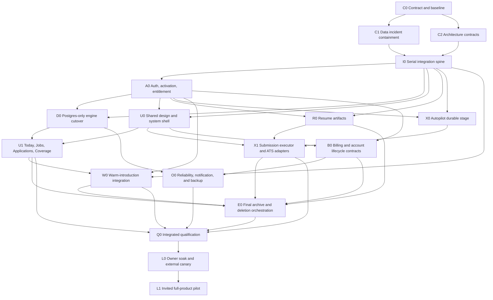

# Full-product roadmap and dependency graph

Status: execution authority after `full-product-pilot-v2` approval
Purpose: enumerate the total remaining work, its order, and the boundary between
parallelizable packets and serial integration

## 1. Current status snapshot

This snapshot is a planning statement, not release evidence. The integration packet
MUST refresh it against the chosen base commit before implementation.

| Area | Current state | Remaining release work |
|---|---|---|
| Discovery engine | Mature adapters and scheduled AWS lanes exist | Generalize every lane per user; use Postgres preferences; remove Sheet paths; validate US/general-role behavior |
| Database | `0001`–`0020` on main | Serially validate/integrate `0021`–`0027`; create missing `0024`; audit RLS/grants/functions/storage |
| Jobs | Redesign and dictionary branches implemented and pushed | Replay on integration branch; add domain/logo and display preference dependencies; complete mobile/live evidence |
| Today | Queue mechanics exist; target composition incomplete | Build target route/sections, counts, follow-ups, fixtures, degraded/mobile states |
| Applications | Pipeline/import/status foundations exist | Target design shell/pane, manual evidence/activity, add flow, full archive and mobile |
| Coverage | Company grid and warm foundations exist | Postgres-only scan contract, three-tab target, activity, source/freshness, mobile |
| Autopilot | Answer/policy and Prepare/Review foundations exist | Durable staging, attachments, submit executor, adapters, receipts, rules/activity, recovery |
| Resume | Owner-specific pipeline exists; product branch incomplete | Generic multi-user editor, secure storage/rendering, artifact lifecycle, private-vault split |
| Warm introductions | Layer 1 plus Layer 2 schema/provider foundations | Integrate UI, fit, multi-pin, 40-result default behavior, outreach funnel and metrics |
| Auth/entitlement | Supabase auth and partial branch | Open signup holding state, activation, default-deny DB/RPC/storage/jobs, lifecycle/revocation |
| Notifications | Digest/action-link foundations; SES constraints | Product templates/preferences/unsubscribe/suppression; no Gmail-status dependency |
| Billing | Design only/partial branch seam | Plan/usage model, founding-free entitlement, Stripe hosted paths/webhook, honest disabled charging |
| Data exit | Dataset export and import exist | Complete archive, object/event inclusion, deletion propagation and restored-backup suppression |
| Operations | Lambda/EventBridge/alerts exist | Per-user health, hosted uptime/app telemetry, secrets/config, encrypted DB/object backup, restore |
| Design parity | Full owner design bundle and gap analyses exist | Land all surfaces/states, deterministic manifest, mobile and accessibility proof |

## 2. Critical-path DAG

## 3. Waves and work streams

### Wave 0 — Truth, containment, and contracts

#### RM-00 Baseline reconciliation

Deliver:

- target base commit and deployment commit;
- current branch/PR/worktree inventory;
- exact migration ledger and applied production versions;
- feature-flag/config manifest without secret values;
- deployed route/capability probe;
- owner-decision ledger and design-bundle digest;
- dirty-worktree exclusion list.

Blocker rule: no build packet starts from a guessed base commit. Migration filenames are
no longer planned or guessed at all — `scripts/new-migration.sh` stamps them
(`YYYYMMDD_HHMMSS_name.sql`, UTC), so parallel packets cannot collide on one.

#### RM-01 Git database-dump containment

The Git dump is not AWS EventBridge. `.github/workflows/pgdump.yml` runs `pg_dump` and
commits `snapshots/pg/hq.sql.gz` to repository history. The AWS `snapshot` lane is a
separate worker and currently protects Sheet snapshots.

Deliver:

- prevent new database dumps from being committed or pushed;
- inventory all known/platform-visible history, forks, clones, caches, artifacts, and
  credentials; document unknowable external clones and treat published material as
  irreversibly exposed;
- classify data and secret/token exposure;
- create an incident record and owner/legal decision point;
- build encrypted, access-controlled, versioned database and object backups;
- prove isolated restore and tenant ownership;
- coordinate history remediation only after replacement restore succeeds.

#### RM-02 Architecture contract freeze

Freeze versioned contracts for:

- authentication/activation/entitlement states;
- owner derivation and tenant isolation;
- commands, idempotency, CAS/versioning, audits, stable errors, and result lookup;
- Postgres and object-storage authority;
- provider capability matrix;
- Autopilot state machines and submission receipts;
- feature flags/kill switches;
- retention/deletion ledger;
- notification eligibility and preference precedence;
- telemetry allowlist/redaction;
- design state manifests and source digest.

### Wave 1 — Serial release spine

Only one integrator may change migrations, RLS, shared RPCs, or shared data-source
interfaces at a time.

#### RM-10 Integrate active branches and migrations

Required order, subject to the refreshed ledger:

1. display dictionary and anti-slop checks;
2. company domains/logo data (`0021`) after full network-address test correction;
3. omit email-review (`0022`) from the launch artifact because Gmail automatic status
   is excluded; preserve its branch as future work, not dormant attack surface;
4. bot/activity runs (`0023`);
5. Autopilot staging/review/approval (`0024`);
6. display preferences (`0025`);
7. generic resume artifacts (`0026`);
8. entitlement/default-deny (`0027`);
9. Jobs/shared-shell redesign replayed against the integrated types.

Required proof:

- empty database build;
- production-like upgrade;
- schema equivalence;
- contiguous unique versions;
- object ownership, grants, RLS, security-definer search paths, and direct-DML denial;
- fixture and production interface equivalence;
- isolated restore compatibility.

#### RM-11 Default-deny identity and access

Build:

- email/password and Google auth;
- pending/holding, active, suspended, deleted, operator, and service states;
- invite/activation and founding-free assignment;
- idempotent provisioning and re-invitation;
- recent-auth operations;
- bounded session/entitlement caches and immediate revocation;
- scheduled-job cancellation and token/queue revocation;
- two-user isolation at database, RPC, storage, cache, export, event, and worker layers.

#### RM-12 Postgres-only engine and Sheet removal

Inventory and replace every Sheet dependency:

- company universe/config reads;
- discovery/user-posting writes;
- applications and human status;
- quick add;
- import/export;
- tracker joins/promotions/stale work;
- heartbeats and digest state;
- scheduled job dispatch;
- bootstrap/self-heal assumptions;
- production secrets and monitoring.

Exit criteria:

- production runs without Google service-account credentials;
- no job reads or writes Sheet state;
- no mirror, reconciliation, dual-write, or Sheet rollback remains;
- historical migration/import tools are isolated from runtime;
- docs and runbooks describe Postgres authority;
- Sheet data is exported/archived and the live dependency is revoked.

### Wave 2 — Shared product shell and platform behavior

#### RM-20 Design foundation and shared shell

Build the exact five-destination rail:

- Today;
- Jobs;
- Applications;
- Autopilot;
- Coverage;
- Settings separate;
- Today is the only nav badge.

Land shared primitives from the owner design sources, not invented replacements:
AppShell, PageHeader, SavedViewTabs, TableToolbar, DisplayPopover, FilterChip,
LogoAvatar, DecisionRow, DetailPane, SelectionBar, StatusChip, SourceChip, empty/error
states, dialogs, shortcuts, command palette, and responsive navigation.

#### RM-21 Cross-cutting system states

Every applicable surface ships:

- initial loading and revalidation;
- populated and empty;
- validation and permission;
- conflict/stale version;
- dependency degraded and rate-limited;
- session expired;
- true offline: writes disabled with approved explanation, no local mutation queue;
- maintenance/feature paused;
- 404 and route error;
- success/undo and irreversible confirmation;
- long text, large type, zoom, narrow phone, touch, keyboard, reduced motion.

#### RM-22 API and event platform

Standardize:

- versioned payload schemas;
- stable machine error codes with safe user messages;
- request/command correlation;
- idempotency-key reuse semantics;
- timeout-after-possible-commit result lookup;
- append-only audit events;
- per-user feature/capability flags;
- provider health and circuit breakers;
- pseudonymous telemetry with content-field denylist.

### Wave 3 — Complete daily product surfaces

#### RM-30 Today

Complete the design-defined sections:

- new roles needing a decision;
- Autopilot work ready for review;
- relevant application/referral follow-ups;
- section omission when truly empty;
- total actionable badge and freshness from the same query contract.

No Gmail-derived suggested status section launches. The layout must remain complete
without it; manual application follow-ups may appear when derived from product state.

#### RM-31 Jobs

Integrate and qualify:

- exact six columns and toolbar budget;
- URL-round-trippable search/filter/view/selection;
- 420px detail pane and Escape/focus behavior;
- `Not listed` absence policy;
- company-domain logo ladder;
- warm-intro indicator in Company cell;
- server export scope equality and spreadsheet-formula defense;
- phone behavior defined by owner design, with no hidden primary action.

#### RM-32 Applications

Complete:

- design status bands over the existing human-wins vocabulary;
- add URL/manual record, import, notes, activity/evidence, manual status and correction;
- optimistic/idempotent writes with undo where reversible;
- version conflict and two-tab behavior;
- attachment/resume association where relevant;
- export and round-trip;
- no implication that Gmail is connected or monitoring.

#### RM-33 Coverage

Complete:

- company universe, review, monitoring, coverage sentence, source quality, freshness;
- activity based on actual per-user runs;
- blind spots and actionable recovery;
- company detail pane;
- connections/referral entry;
- no Sheet source, sync, or fallback language.

#### RM-34 Settings, onboarding, landing, and auth

Complete:

- general US role/location/pay/work-model/deal-breaker profile;
- deterministic preview and explicit re-gate decision;
- display settings;
- notification preferences;
- connected accounts excluding Gmail mailbox;
- Autopilot answers/policies;
- plan/usage;
- data archive/deletion;
- support/privacy/terms;
- public landing, signup/sign-in/recovery/holding/suspension states.

### Wave 4 — Resume productization

#### RM-40 Personal-vault split

Move owner-only resume, applications, interview-prep, snapshots, and private history to
the private vault plan. The public product MUST have:

- no Salman-specific content, role defaults, truth rules, contact data, applications, or
  interview material;
- generic fixtures and synthetic demo data;
- a clean public/private boundary and secret/history audit.

#### RM-41 Resume domain and storage

Build tenant-owned:

- resume document/version/artifact entities;
- structured editor with import and full supported RenderCV flexibility;
- uploaded resume path;
- secure object keys and signed access;
- immutable render version and checksum;
- artifact status, failure, retention, export, and deletion;
- template/theme compatibility and accessibility.

#### RM-42 Render and attachment workflow

Build:

- server-side isolated rendering with resource/time/size limits;
- preview on phone and laptop;
- deterministic PDF/DOCX artifact selection;
- pre-application attachment validation;
- exact version shown in Autopilot review;
- rejection of wrong-owner, deleted, stale, corrupt, oversize, and unsupported files.

### Wave 5 — Autopilot full scope

#### RM-50 Durable Prepare and Review

Persist owner-scoped:

- application/provider/form identity;
- live form schema and hash;
- parsed fields;
- deterministic resolved answers with source/evidence;
- unresolved/sensitive gaps;
- attachment checksums;
- immutable reviewed payload;
- state, version, timestamps, audit.

The canonical state machine and legal transitions are defined in
`packets/06-autopilot-state.md` and `packets/07-autopilot-execution.md`. Arrow shorthand
is forbidden because `needs_input` is conditional, edits create new versions, approval
can expire, and cancellation legality depends on whether the irreversible action began.

Approval never infers sensitive facts. Work authorization, visa, EEO, compensation,
legal identity, criminal/background, and free-response claims require explicit user
facts or review.

#### RM-51 Execution-host decision and protocol

Before implementation, select and threat-model the execution host:

- hosted browser;
- user-owned MV3 browser extension/desktop agent;
- hybrid hosted control plane plus user-owned execution;
- another architecture proven against provider behavior.

Required properties:

- users can review/approve on phone;
- production control plane is hosted and unattended;
- credentials/cookies have least exposure;
- signed single-use commands;
- agent health/version/pause/revocation;
- no CAPTCHA bypass or covert anti-bot evasion;
- duplicate-submit prevention across retries/devices;
- owner-scoped receipt return;
- safe behavior when executor disappears mid-submit.

This is an owner/architecture/security decision, not a cheap-model choice.

#### RM-52 Submission core

Build:

- live-form re-fetch and schema-drift comparison;
- authorization immediately before irreversible submit;
- idempotency/deduplication key;
- exact payload/attachment verification;
- provider throttle and circuit breaker;
- controlled submit;
- confirmation interpretation;
- immutable receipt and screenshot where allowed;
- `outcome_unknown` reconciliation that never auto-retries blindly;
- per-user/global/provider kill switches.

#### RM-53 Provider packets

Separate packet and evidence per family:

- Greenhouse;
- Ashby;
- Lever;
- SmartRecruiters;
- selected account/OTP providers after security/UX qualification.

Google Careers, LinkedIn Easy Apply, CAPTCHA-blocked flows, and policy-incompatible
providers receive the honest manual handoff unless separately approved. A manual handoff
preserves prepared answers, selected attachments, link, checklist, and user-recorded
outcome.

#### RM-54 Rules, activity, and autonomy

Build:

- global pause;
- provider/role/company policy;
- manual-review threshold;
- sampled post-submit review;
- success/failure/drift rate;
- trust reset on adapter/version change;
- full activity and receipt access;
- notification after confirmed/unknown/failed outcomes.

Unless ADR-002 authorizes policy-driven unattended execution, production requires
explicit per-application approval. If ADR-002 authorizes unattended execution, this
packet MUST add eligibility, sampling, trust thresholds, reset triggers, consent, and
pause behavior to the contract/register before release.

### Wave 6 — Warm introductions and referral workflow

#### RM-60 Provider search integration

Complete:

- official connection import and manual contact add;
- on-demand HarvestAPI/provider search without user LinkedIn cookie/session;
- three editable persona searches;
- ordinary no-result, cancellation, timeout, and provider-limit states;
- default target 40 deduplicated results total across the three searches, configurable
  up to 50; provider shortfall is ordinary and this is not a commercial user cap;
- provenance and result retention;
- per-candidate fit using user profile, role, company, seniority, function, and available
  evidence;
- multi-select pins and manually added pins.

#### RM-61 Human outreach funnel

Build:

- contact entity and role/company relation;
- `identified → contacted → replied → referred → interview` stages;
- drafts/templates with explicit user review;
- copy/open actions but no automated message sending;
- follow-up date and notes;
- outcome metrics and Today reminders.

### Wave 7 — Commercial seam, notifications, and account lifecycle

#### RM-70 Plan and billing

Build:

- plan/entitlement/usage schema;
- `founding_free` all-access behavior;
- honest plan and usage UI;
- Stripe hosted Checkout and customer portal;
- signature-verified, replay-safe webhook;
- cancellation, downgrade, failed-payment, grace, refund, and tax policy states;
- capability checks at database/RPC and worker boundaries.

Charging remains off for founding users. Test mode MUST be used until the owner approves
commercial activation.

#### RM-71 Product notifications

Build:

- in-app notifications;
- opted-in digest/role/submission/follow-up email;
- preference precedence, quiet hours, unsubscribe, bounce and suppression;
- signed action-link expiry/replay/revocation;
- no Gmail mailbox scope or automatic status dependency;
- sender/support identity and SES/provider production readiness.

#### RM-72 Full archive and deletion

Archive includes:

- profile/settings/entitlements;
- jobs/decisions/saved views;
- applications/notes/activity;
- answers/policies/staged applications/submission receipts;
- resume source/version/artifacts;
- companies/connections/referral funnel;
- imports and audit manifest.

Deletion stops sessions, workers, queued commands, notifications, provider tokens, and
future submissions before deleting content. A deletion ledger prevents a restored older
backup from reactivating the user.

### Wave 8 — Integrated qualification and launch

#### RM-80 Security and privacy qualification

Perform:

- OWASP ASVS-aligned threat and control review;
- direct DB/RPC/storage two-user negative testing;
- default-deny mutation;
- SSRF/address corpus;
- upload/parser/render sandbox tests;
- provider credential and webhook tests;
- submission replay/duplicate/unknown-outcome tests;
- dependency/software-secret review;
- privacy inventory, retention, export, and deletion rehearsal.

#### RM-81 Design, accessibility, and mobile qualification

Require:

- authoritative design digest;
- state/route/viewport manifest;
- exact copy/tokens/geometry/interaction evidence;
- computed-style anti-slop sweep;
- visual regression at owner-defined viewports;
- keyboard/focus/screen reader/zoom/reduced motion;
- 320/375 phone, tablet, desktop, long strings, empty/loading/error/degraded states;
- owner review of every explicit design gap or addendum.

#### RM-82 Reliability, performance, and recovery

Require:

- hosted uptime and application error/trace monitoring;
- per-user lane health;
- SLO dashboards and actionable alerts;
- queue retry/poison-item/rate-limit behavior;
- dependency outage and recovery;
- load/cardinality/large-import/large-history tests;
- database and object restore;
- rollback/flag-disable rehearsal;
- no owner-laptop dependency.

#### RM-83 Release candidate and staged launch

Require:

- exact commit/config/environment/evidence bundle;
- zero severity 0/1 issues;
- every requirement linked to passing evidence;
- owner seven-day soak using only production webapp;
- one external canary for 48 hours;
- stop-condition review;
- bounded invitation waves with support/monitoring active.

## 4. Parallelization rules

May run in parallel after their contracts freeze:

- independent UI surfaces with non-overlapping files;
- fixtures, state manifests, copy audits, accessibility cases;
- one ATS adapter per frozen executor interface;
- import/export compatibility, notification templates, and runbooks;
- read-only audits and evidence assembly.

Must remain serial:

- migration numbers and schema changes;
- RLS, grants, security-definer RPCs;
- identity/entitlement authority;
- shared data-source interfaces;
- Postgres/Sheet cutover;
- execution-host and credential architecture;
- production backup/history remediation;
- Stripe webhooks and commercial authorization;
- final integration and release decisions.

## 5. Definition of done for every roadmap item

An item is done only when:

1. its requirements are stable and traceable;
2. acceptance and negative cases existed before or alongside implementation;
3. the authoritative boundary is tested, not only mocked;
4. a deliberately violating implementation or fixture is proven to fail;
5. fixture and production behavior agree;
6. privacy, authorization, observability, recovery, and disablement are complete;
7. design/mobile/accessibility evidence exists where visible;
8. an independent reviewer accepts the evidence;
9. the change is integrated and retested on the exact release line; and
10. the central ledger records commit, evidence, risks, and follow-on work.
